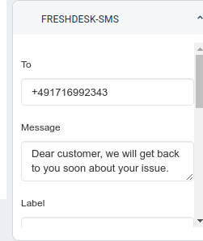

# sms77 for freshdesk

## Description

This app enables an agent to send SMS and make text-to-speech calls to customers.

Works on:
- contact details page
- ticket details page

***

## Screenshots

***

## Development

### Prerequisites

1. Make sure you have a (trial) Freshdesk account created
2. A properly
   configured [Development environment](https://developers.freshdesk.com/v2/docs/quick-start/)
   along with
   the [FDK (Freshworks Development Kit)](https://developers.freshdesk.com/v2/docs/freshworks-cli/)
   .
3. A [sms77](https://www.sms77.io) account with API key.

### Usage

1. Run the app locally using
   the [`fdk run`](https://developers.freshdesk.com/v2/docs/freshworks-cli/#run) command.
2. Go to `http://localhost:10001/custom_configs` in your browser to set up your sms77 API
   key
3. Go to Freshdesk, navigate to the tickets page and select any ticket
4. Refer to
   the [Test your app](https://developers.freshdesk.com/v2/docs/quick-start/#test_your_app)
   section of the quickstart guide to allow insecure content.
5. Append `?dev=true` to the URL to see the changes
